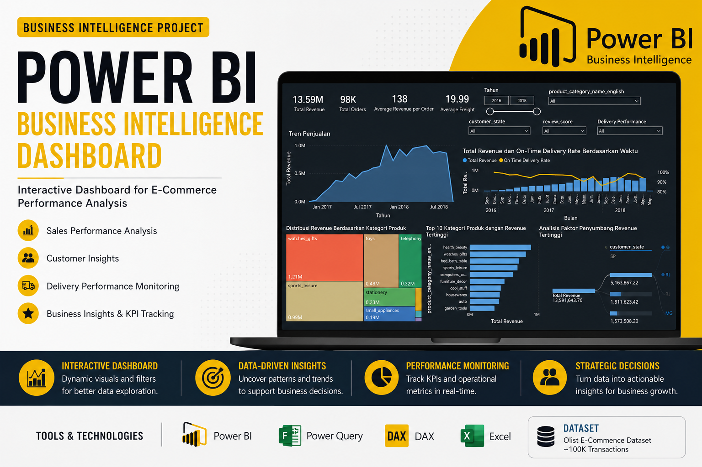

# 📊 Power BI Business Intelligence Dashboard

## 📌 Project Overview

Developed an interactive Business Intelligence dashboard using Power BI to analyze approximately 100,000 e-commerce transactions from the Olist Brazil dataset. The dashboard provides insights into sales performance, customer satisfaction, and logistics operations through interactive visualizations.

---

## 🎯 Objectives

- Analyze sales performance
- Monitor customer behavior
- Evaluate logistics performance
- Track business KPIs

---

## 🛠️ Tools

- Power BI
- Power Query
- DAX
- Microsoft Excel

---

## 📈 Dashboard Overview

### Key Insights

- Monitored sales performance using interactive KPI cards and trend visualizations.
- Identified customer satisfaction through review score analysis.
- Evaluated delivery performance by comparing estimated and actual delivery times.
- Enabled dynamic filtering using slicers for flexible business reporting.

---

## 💼 Business Value

This dashboard enables decision-makers to monitor key business metrics, identify operational trends, and support data-driven decisions through interactive reporting.

---

## 📂 Repository Contents

- Olist_Business_Dashboard.pbix
- Olist_Business_Dashboard.pdf
- README.md

---

## 👨‍💻 Author

**Haflatul Huda Ali**
